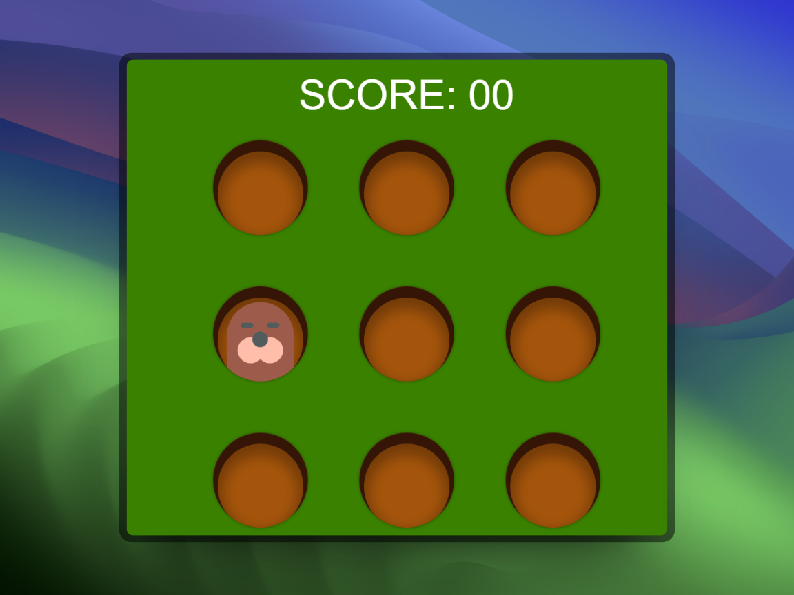

# 🐹 Tape Taupe

<div align="center">
  
</div>

---

<div align="center">
🎯 Vous connaissez **Tape Taupe** (*Whack-a-mole* dans la langue de Shakespeare) ?  
Ce célèbre jeu dans lequel des taupes sortent de leur trou,  
et il faut les assommer le plus vite possible !  

💥 Eh bien... j'aimerais bien y jouer. Du coup, je l’ai codé.
</div>

---

## 🚀 Fonctionnalités

- 🕹️ Interface de jeu interactive et animée  
- 🐾 Apparition aléatoire des taupes  
- ⏱️ Compte à rebours pour défier le chrono  
- 💯 Système de score en temps réel  
- 🎨 Design simple, fun et responsive

---

## 🎮 Comment jouer

1. Clique sur **"Démarrer"** pour lancer la partie.  
2. Tape les taupes qui apparaissent dans les trous avant qu'elles ne disparaissent !  
3. Chaque taupe touchée = **+1 point**.  
4. Essaie d’avoir le meilleur score possible avant la fin du temps imparti 🧠⚡

---

## 🧰 Technologies utilisées


---

## 📦 Installation

```bash
git clone https://github.com/TonPseudo/tape-taupe.git
cd tape-taupe
```

Puis ouvre `index.html` dans ton navigateur préféré 🧑‍💻

---

🙌 Remerciements  
Merci d’avoir pris le temps de découvrir ce petit jeu rétro remis au goût du jour !  
Projet fun et 100% **fait maison** dans le cadre d’un apprentissage **JS DOM + events**.  
N’hésitez pas à le tester, forker, ou l’améliorer à votre sauce 🎨

<div align="center">

⭐ *Un petit like sur le repo fait toujours plaisir !* ⭐

</div>
